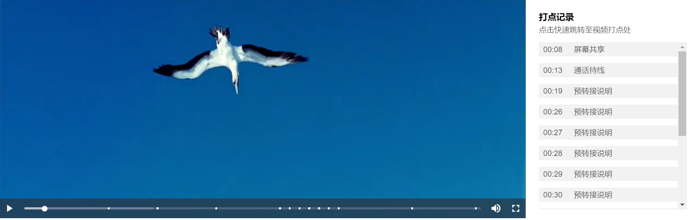

# videojs-marker-plugin



## Demo
see [here](https://siaikin.github.io/videojs-marker-plugin/)

## 安装

1. 下载压缩包文件
2. 通过npm安装
    ```sh
    npm install --save videojs-marker-plugin
    ```

## 用法
注: `videojs-marker-plugin` 依赖 `videojs` 需要先在项目中引入 `videojs`.

### `<script>` 标签

```html
<script src="//path/to/video.min.js"></script>
<script src="//path/to/videojs-marker-plugin.min.js"></script>
<script>
  var player = videojs('my-video');

  player.markerPlugin({
    //  打点信息
    markers: [
      {
        offset: 1,
        type: 'text',
        data: {
          content: 'content1'
        }
      },
      {
        offset: 2,
        type: 'text',
        data: {
          content: 'content2'
        }
      },
    ],
    // 是否展示右侧面板
    panel: true
  });
</script>
```

### require 引入

```js
var videojs = require('video.js');

// The actual plugin function is exported by this module, but it is also
// attached to the `Player.prototype`; so, there is no need to assign it
// to a variable.
require('videojs-marker-plugin');

var player = videojs('my-video');

player.markerPlugin({
  //  打点信息
  markers: [
    {
      offset: 1,
      type: 'text',
      data: {
        content: 'content1'
      }
    },
    {
      offset: 2,
      type: 'text',
      data: {
        content: 'content2'
      }
    },
  ],
  // 是否展示右侧面板
  panel: true
});
```

## 插件参数和接口

### 初始化参数
| name | type | description |
| ---- | ---- | ----------- |
| markers | Array<MarkerPointInfo> | 一个包含打点信息的数组 |
| panel | boolean | 是否展示右侧打点信息面板 |

```javascript
markerPlugin({
  markers: [
    //  MarkerPointInfo
    {
      //  这条打点记录相对于视频时间轴的零点的偏移量(以秒为单位), 会跟据该值决定打点显示在进度条中的位置.
      offset: 1,
      //  打点类型, 目前仅有 `text` 类型
      type: 'text',
      //  打点数据, content内为打点文本内容
      data: {
        content: 'content'
      }
    }
  ],
  panel: true
})
```

### 接口

#### 更新打点信息

```javascript
plugin.updateOptions({
  markers: [
    {
      offset: 1,
      type: 'text',
      data: {
        content: 'content'
      }
    }
  ],
  panel: true
});
```

[videojs]: http://videojs.com/
